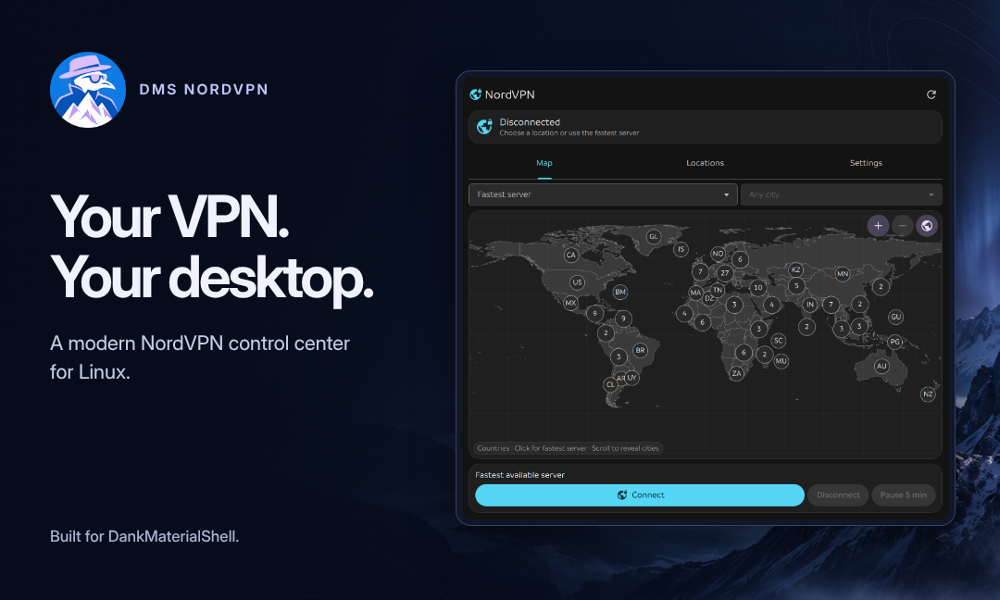
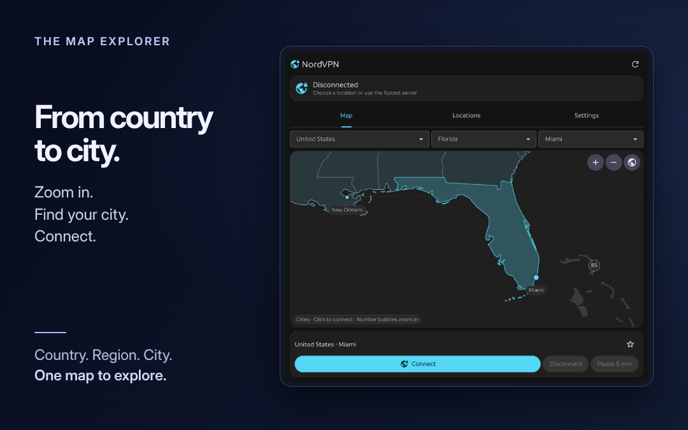
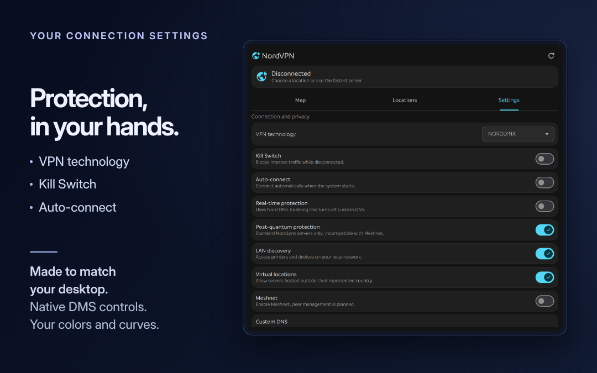
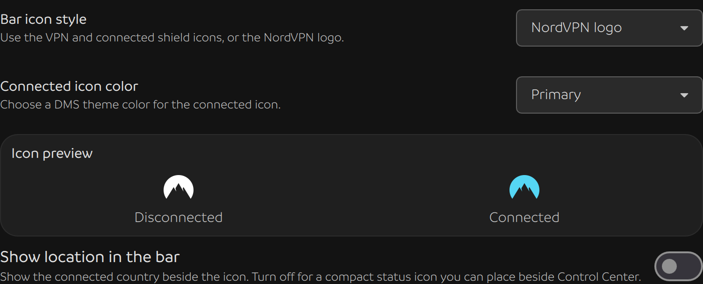

<div align="center">


<h1>DMS NordVPN</h1>

<h3>A modern NordVPN control center for Linux.</h3>

<p>Explore the world. Find your city. Make yourself at home.</p>

<p><strong>Interactive map · Native DMS styling · DankBar &amp; Control Center</strong></p>

<p><a href="#a-world-of-connections">Explore</a> · <a href="#your-vpn-essentials-together">Features</a> · <a href="#get-started">Get started</a></p>

</div>

[](assets/screenshots/world.png)

NordVPN Control brings a visual VPN experience to **DankMaterialShell**. Browse destinations on a detailed world map, manage your protection, and check your connection from the desktop you already love.

## A world of connections

Start with a country's fastest server. Scroll closer and cities appear. Open a numbered cluster to explore an area, or narrow your search with the U.S. state picker. From a world overview to Miami, the map gives you room to find your next connection.

Pan, zoom, and connect directly on the map. Prefer a list? Search countries and cities, select a destination, and press **Connect**.

[](assets/screenshots/florida.png)

[World overview](assets/screenshots/world.png) · [United States](assets/screenshots/united-states.png) · [Miami](assets/screenshots/florida.png)

> Country and city pins connect immediately. Zooming, panning, and opening clusters let you browse.

## Your VPN essentials, together

| Feature | What you can do |
| --- | --- |
| **Connect your way** | Choose the fastest server, a country, a city, or an available specialty group. |
| **Stay in control** | Disconnect, or pause for five minutes when your NordVPN client supports it. |
| **Manage protection** | Access supported settings for Kill Switch, auto-connect, connection technology, real-time protection, post-quantum protection, and custom DNS. |
| **Keep favorites close** | Save favorite countries and return to city lists that persist across desktop restarts. |
| **See your connection** | Check live connection status without leaving your shell. |

[](assets/screenshots/settings.png)

Available settings follow the capabilities of your installed NordVPN Linux client.

## Made to match your desktop

Your colors. Your fonts. Your corners. NordVPN Control follows DMS's theme as you change it, including button styles, cards, transparency, outlines, and scrollbars.

Use it in a horizontal or vertical **DankBar**, or add a **Control Center** tile. The same connection is shared across your widgets.

Choose **VPN / shield** or the **NordVPN logo** in the plugin settings. The logo is white while disconnected and uses your chosen DMS theme color when connected. Pick Primary, Secondary, Tertiary, Success, Information, Warning, or the bar's icon color; it stays in sync with your theme.



Want a compact status icon? Turn off **Show location in the bar** and place NordVPN next to Control Center. You can hide DMS's built-in VPN indicator in the Control Center widget options.

## Get started

You'll need **DankMaterialShell 1.6.0+**, **Qt 6.11+**, **Python 3**, and the **NordVPN Linux CLI** installed, logged in, and working as your desktop user.

Install directly from GitHub:

```bash
mkdir -p ~/.config/DankMaterialShell/plugins
git clone https://github.com/JamesFromFL/dms-nordvpn.git ~/.config/DankMaterialShell/plugins/NordVPNControl
```

1. Open **DMS Settings → Plugins**, scan for plugins, and enable **NordVPN Control**.
2. Add it to **DankBar** or **Control Center**. Open the panel and choose your destination.

Prefer a ZIP? Use **Code → Download ZIP** on GitHub, extract it, and copy the plugin folder into `~/.config/DankMaterialShell/plugins/` with the name `NordVPNControl`.

**Updating a Git installation?** Run:

```bash
git -C ~/.config/DankMaterialShell/plugins/NordVPNControl pull --ff-only
dms restart
```

For a ZIP installation, replace the installed plugin folder and run `dms restart`. Your favorite countries and saved city lists stay with DMS.

---

<div align="center">

<p><strong>Your VPN. Your desktop.</strong></p>

<p>Created by <strong>JamesFromFL</strong>.</p>

<p>An independent community plugin for <a href="https://danklinux.com/">DankMaterialShell</a>. Not affiliated with NordVPN.</p>

<sub>Geography: <a href="https://www.naturalearthdata.com/">Natural Earth</a> · Locations: <a href="https://api.nordvpn.com/v1/servers/countries">NordVPN's country and city catalog</a></sub>

</div>
